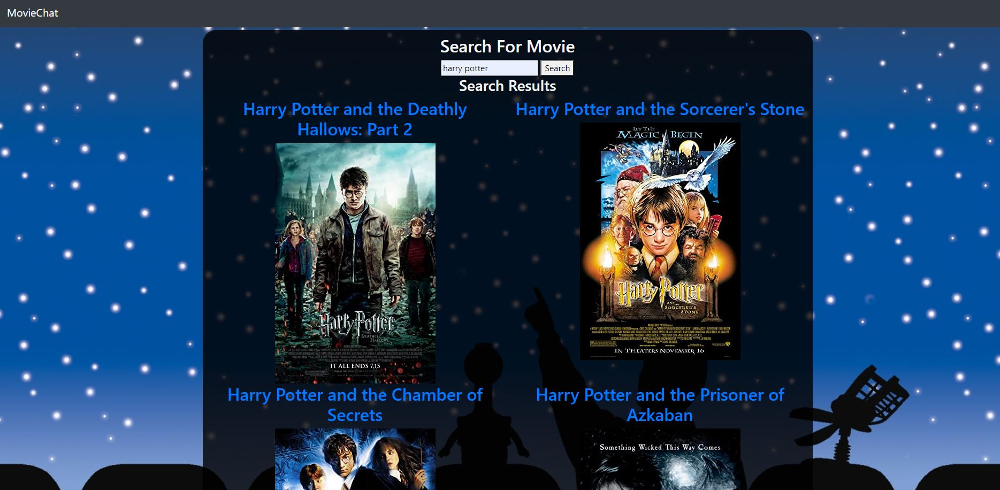
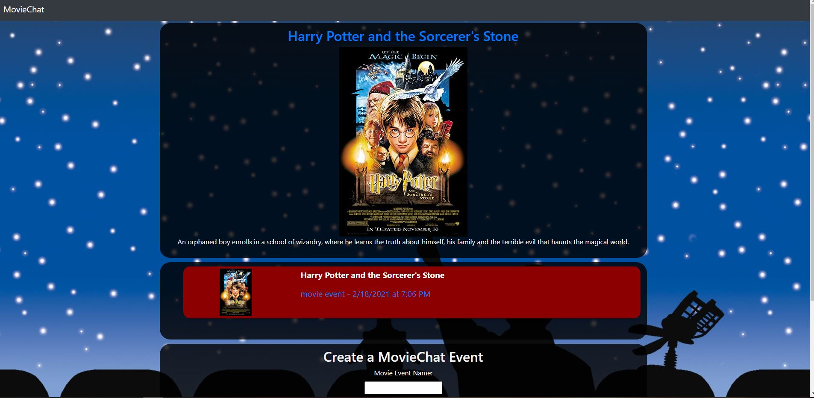
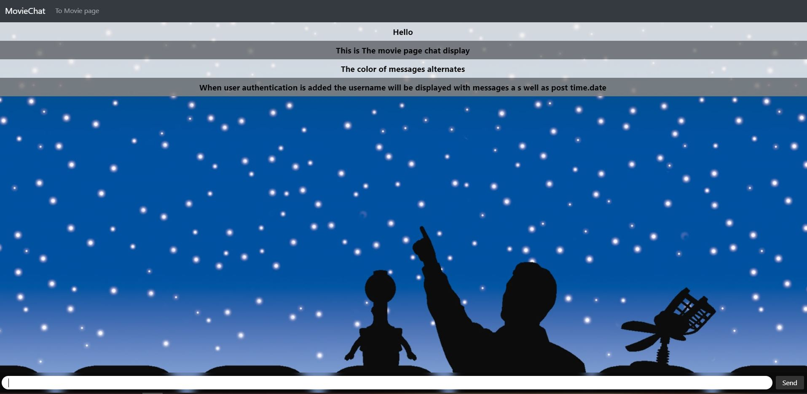

# Movie Chat

## Table of Contents
[Description](#description)

[Installation](#installation)

[Usage](#usage)

[Credits](#credits)

## Description
Have you ever wanted a social media that allows you to organize movie watch parties with others? Well your in luck with movieChat this is now possible.

This repository contains a full stack web app That communicates with a database, and is designed around the Model,View, Controller philosophy. A user can organize view parties around certain movies, and chat with other viewers in view party room. This webapp uses socket.io to create a live chat room. The following images are screen shots showcasing the technology.

### Main
    The Index page Contains a movie search form. As well as a list of view parties that already exist

### Movie Page
    The Movie Page Displays movie information recieved from omdb, a Form to create view parties, and a list of viewparties for the movie.

### Chat Page

    The chat room displays all messages for a specific room, and updates live thanks to socket.io.

## Installation
Downloading respository. In directory run npm install. This program requires mysql.
Run schema.sql in mysql to create database.
Edit config file in way of choosing to tie database name, username and password of mysql.

## Usage
The application is deployed to https://stark-taiga-85419.herokuapp.com/.
Server can be run in test usage with node server.js command, or npm run start.

## Goals

Add User authentication and user profile page.
Add more information to check list.
Create nice banner On index page.
Make styles not look bad.
Restructure chat page to contain more information about room. (Ex: Number of users connected)
Add see more messages button on page load to prevent page lag.

## Credits
All commits post fork by Andrew Ehrman,

Forked from rhubble1987/project-2

Credited in rhubble1987/project-2:

Andrew Ehrman

Ryan Hubble

CJ hansen

Alexander Thompson

### Components Used
Node

npm packages

mysql

express

express-handlebars

dotenv

eslint

socket.io

sequelize-cli

API's

OMDB